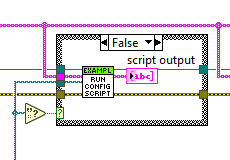
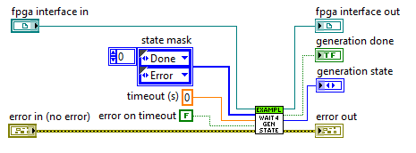
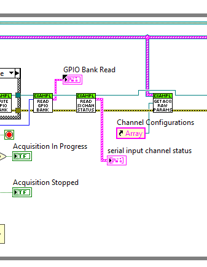
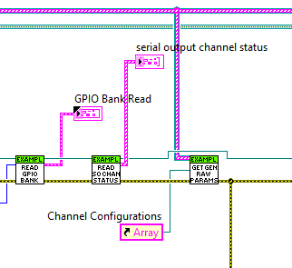
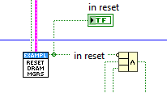
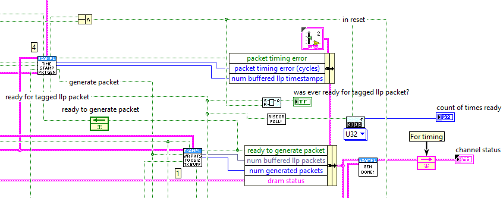

# PXIe-148X Getting Started Example - Troubleshooting Guide
{: .no_toc }

Refer to this document to get insights and suggestions on troubleshooting performance issues, error codes, and problems with using the PXIe-148x Getting Started Examples (GSE).

> Note: This document references the example included with the NI-FlexRIO 22Q3 driver. Examples included in newer releases of the driver should be applicable.

### Table of contents
{: .no_toc }

1. TOC
{:toc}

---

## TODO List
1. (Nick) Update Error/Warnings Code with Possible Causes and Troubleshooting Options.
2. (Nick) Update Common Scenarios with Possible Causes and Troubleshooting Options.
3. (Nick) Write section - Host-FPGA General Debugging Workflow
4. (Josh) Create SI and SO Channel Status SubVIs and Add to All 3 GSEs
5. (Nick) Write sections - Get serial input channel status from the FPGA & Get serial output channel status from the FPGA
6. (Nick) Write section - Instrumenting and Monitoring FPGA Behavior
7. (Josh) Write section - Optimize System Settings for Streaming Performance
8. Look in csi2serdesconfig source for list of unique error codes and add to table (timebox 2 hours)
---

## Error/Warnings Codes

| Error | Explanation | Possible Causes | Troubleshooting Options |
|-|-|-|-|
| -1210 | Multiple entries for the same serial channel detected in serial channel configurations array. | Self explanatory | - Verify the Serial Channel control does not contain duplicates. |
| -1210 | Data type <datatype> is invalid | The data type selected of the serial channel is not supported for display. | Select a valid data type for the payloads of the channel you wish to display. See Configure Serial Display Channels.vi and Read Pixels and Copy to Display Image.vi SubVIs for valid data types. |
| -1210 | Invalid GPIO bank | The value selected in the **GPIO Bank Control** is not a valid choice for the board.  | - Verify the GPIO value in the control.  - Review the Host-FPGA General Debugging Workflow |
| -1210 | Invalid display channel | The display channel selected has not been configured for display in the FPGA | - Select a channel that has been configured in the FPGA for display  - Modify the FPGA VI so that the channel of interest is configured for display and recompile the FPGA image |
| -52012 | FIFO overflow. Transfer aborted due to a loss of data as a result of a FIFO overflow. | One of the many FIFOs between the Host and FPGA has overflowed. | [How to Debug FIFO Overflow Errors](#how-to-debug-fifo-overflow-errors--52012) |
| -52018 | Bad packet size detected on SI<0...7>. Transfer aborted due to data corruption as a result of a packet size that did not match the expected value. | The packet payload was larger or smaller than the packet header indicated. | Verify the camera is powered properly and connections on the serial input channel are correct. |
| -200474 | Timed out while waiting for acquisition state. | No valid CSI-2 packets were detected.  | Verify the camera is powered properly and connections on the serial input channel are correct. |
| -200474 | Timed out while waiting for generation state. | No valid CSI-2 packets were sent from the host.| Verify the TDMS data set used is valid. |
| -304321 | Error -304321 occurred at The requested I2C transaction was unable to complete. This is usually because the requested I2C address was not acknowledged, or because the I2C slave prematurely terminated the transaction. | - Wrong script used  - Script syntax error  - Device attached to PXIe-148x module not found | [How to Debug Incomplete I2C Transaction Errors](#how-to-debug-incomplete-i2c-transaction-errors--304321) |
| -375704 |  Display channel number <0...7> is invalid | The display channel selected is not between 0 and 7 | Make sure the channel number is between 0 and 7 and select a channel that has been configured in the FPGA for display. |

| Warning | Explanation | Possible Causes | Troubleshooting Options |
|-|-|-|-|
| 1302 | Array size mismatch for serial output channels and active lane counts. | The array sizes of the controls do not match. | Makes sure the serial output channels and active lane count array sizes are matched. |
| 1302 | Array size mismatch for serial output channels and data rates. | The array sizes of the controls do not match. | Makes sure the serial output channels and data rate array sizes are matched. |

## Common Scenarios

In additional to observed error codes, some common scenarios can occur that require investigation.

| GSE Type | Scenario | Possible Causes | Troubleshooting Options |
|-|-|-|-|
| Gen | Packet timing errors detected on generation | This has many root causes. | [How to debug Generation GSE packet timing errors](#how-to-debug-generation-gse-packet-timing-errors) |
| Gen | Generation doesn't start after clicking **Serializer Setup Complete** | - If your data set has timestamps too far in the future, DRAM can fill up but nothing will generate waiting for timer to hit that first timestamp. You can hit the host side timeout which defaults to 30 seconds.   - You don't have consistent data stream of valid packets and can 'go idle'. If you are idle for long enough, it will automatically stop your generation (everything goes to false)| [How to debug issues with generation not starting](#how-to-debug-issues-with-generation-not-starting) |
| Acq | VI 'hangs' after acquisition completes but does (eventually) stop | The VI is trying to display too many logged packets. | Change the type of packets logged, or disable logging packets to disk. |
| Any | I2C packets are not logged as expected | This has many root causes. | - Make sure that the I2C settings are correct for the serial channel you are interested in. - Refer to [How to Debug Incomplete I2C Transaction Errors](#how-to-debug-incomplete-i2c-transaction-errors--304321) |
| Any | GPIO line change not logged as expected | This has many root causes. | - Make sure that the GPIO settings are correct for the serial channel you are interested in. |
| Any | Display **Source Rate (fps)** and **Update Rate (fps)** both lower than expected | System bandwidth cannot support this sustained rate. | Reduce system bandwidth by modifying the display settings. Refer to [Reducing system bandwidth usage](../../gse-gen-common.md#reducing-system-bandwidth-usage) |
| Any | Display **Update Rate (fps)** lower than the display **Source Rate (fps)** | The Source rate is calculated from reading the display metadata FIFO. If you can't keep up pushing to display at same rate you're pulling in source data, Display will be lower (skipping images). | Use Skip Line/Pixels to reduce size and remove need to resample on host. Saves bandwidth and CPU resources. Or use Skip Frames to reduce frames sent if can't be displayed anyway (e.g. HW limitations) |
| Any | Bitfile build failure occurs | Limited resources available in FPGA | General guidelines on easy pieces to remove/tweak in GSE FPGA VIs |

## Troubleshooting Guides

### How to debug incomplete I2C transaction errors (-304321)
Most errors can be resolved with one of the following steps:
1. On a 1487, there are three loopback scripts for odd channels, even channels, or both. Ensure the correct script is used for the desired serial channel.
2. A camera may not be powered on. Double check the Power over Coax settings are correct to power on the camera from the PXIe-148x acquisition board.
3. Script may have invalid commands - need to compare camera data sheet vs script commands

For help in determining the root cause of the error, wire the script output from the Run Configuration Script VI to an indicator and enable the **Log I2C to Disk** control. Run the VI and compare the script output to the logged I2C traffic.

### How to debug FIFO overflow errors (-52012)
The Getting Started Examples use many FIFOs to pass data and metadata between the Host and the FPGA. While many of these FIFOs are small or transmit small amounts of data, any of them can fail as you approach your total system bandwidth limitations.  Below are the FIFOs you can find the in the Acqusition, Tap, and Generation examples and links to other debugging steps to take when encountering these errors.

-  Acquisition/ TAP FIFOs
    - LLP Packets FIFO - There is one of these FIFOs per serial channel. These can overflow if the FIFO sending data from the FPGA to the host does not have any space in it. This can happen when we do not write LLP packets to disk on the host side fast enough and make space in the FIFO for incoming data. For a more detailed explanation refer to [How to debug Acquisition FIFO overflow](#how-to-debug-acquisition-fifo-overflow).

- Common FIFOs - These FIFOs are small and do not move much data to the Host. If one of these FIFOs overflows, it is usually indicative a system bandwidth limitation. Try following steps from other troubleshooting guides below. 
    - Image Data FIFO - There are two of these FPGA to Host FIFOs by default in each GSE. Refer to [How to debug image display that does not show images or has a low frame rate](#how-to-debug-image-display-that-does-not-show-images-or-has-a-low-frame-rate).
    - Image Metadata FIFO - There are two of these FPGA to Host FIFOs by default in each GSE. Refer to [How to debug image display that does not show images or has a low frame rate](#how-to-debug-image-display-that-does-not-show-images-or-has-a-low-frame-rate).
    - I2C Timestamp FIFO - There is one of these FPGA to Host FIFOs by default in each GSE.
    - GPIO Timestamp FIFO - There is one of these FPGA to Host FIFOs by default in each GSE.

- Generation FIFOs - It should not be possible to see a FIFO overflow on the Host to FPGA LLP Packets FIFOs. The generation GSE holds off on writing data to the FIFO until the FIFO has space available. Refer to [How to debug Generation GSE packet timing errors](#how-to-debug-generation-gse-packet-timing-errors) for more Generation GSE specific debugging.

### How to debug Generation GSE packet timing errors
The first thing to check is the Serial Output Channel Status indicator. Verify that the bytes going in and coming out of the DRAM match. If the DRAM manager is overflowing, it means the number of packets being sent out the serial output channel is less than then packets being sent from the host. Verify the TDMS data set has timestamps running at the correct rate.
Refer to [Get serial output channel status from the fpga](#get-serial-output-channel-status-from-the-fpga).
 
If you cannot figure out what part of the serial output data path is causing the timing errors, or are seeing FIFO overflow errors, take these steps to reduce system bandwidth. You can start by refering to gse-gen-common.md#reducing-system-bandwidth-usage. Afterwards, try some of these tasks to see which part of your system or data set is responsible for causing overflows.

- Disable display (or shrink image size)
- Use smaller packets (reduce bandwidth requirements)
- Set your timing error limit so high that we don't error out, and then see if DRAM manager still fills up
- Use the [TDMS file creator](../gse-create-tdms.md) to create a known good set of csi-2 packet data with the desired timing characteristics and verify your generation completes successfully 
- Reduce serial output channel count

### How to debug Acquisition FIFO overflow
The first thing to check is the Serial Input Channel Status indicator. You should verify that the bytes going in and coming out of the DRAM match. If the DRAM manager is overflowing, it likely means the FPGA to Host FIFO is pushing back on the DRAM manager and the DRAM partition is getting full.
Refer to [Get serial input channel status from the FPGA](#get-serial-input-channel-status-from-the-fpga).

It is hard to distinguish if DMA is pushing back on DRAM causing DRAM overflow (e.g. system can't receive data fast enough, this can be many root causes), or if it's just data coming in faster than we can handle (FPGA simply can't handle this data rate).

- If downstream is not ready for output and you overflow, likely it's downstream at issue (DMA pushing back)
- If downstream is ready, and you overflow, DRAM manager might not be able to handle. This scenario is generally unlikely based on empirical testing. 

If one of the two scenarios above is suspected, you can instrument the FPGA to determine where in the data path you are getting clogged up.
Refer to [Instrumenting and Monitoring FPGA Behavior](#instrumenting-and-monitoring-fpga-behavior).

Things we can suggest to look into:
- Double check Active Lane rate and count are matched throughout your system (Camera -> Instrument)
- Look at the Serial Channel Input Status array for patterns, are problems always following a specific channel?
- Verify DRAM filling, try to compare rate of DRAM filling vs FIFO transfer rate to host
- Reduce the acquisition to a single channel and verify that it stops successfully.

### How to debug image display that does not show images or has a low frame rate
Images display with a reduced frame rate or do not display at all when the system does not have the bandwidth to keep up with the images coming from the FPGA.

Refer to [Reducing system bandwidth usage](../../gse-gen-common.md#reducing-system-bandwidth-usage) to reduce the bandwidth display is using.

### How to debug issues with generation not starting
If generation never starts, the first thing to check is the generation start thresholds configured in the Host\Gen\API\Configure Serial Output Channels.vi.

- **timestamp buffer start threshold** - The minimum number of timestamps that must be buffered before generation begins
- **packet data buffer start threshold (bytes)** - The minimum number of valid csi-2 packet bytes that must be buffered before generation begins
- **dram partition start threshold (bytes)** - The number of bytes that dram partition must have stored before generatoin begins

The most common way to force the generation to start is the reduce the above thresholds to zero, and increase the **packet timing error threshold (cycles)** to a very large number (e.g. FFFFFFFFFFFFFFF0) so that it will never have a timing error and generation will start immediately. Then you can look at the Serial Channel Output Status indicator to determine if the channel is otherwise behaving correctly.

TODO - Take a look at FPGA\Gen\SubVIs\Monitor Ready For Start Condition.vi and document the logic on what triggers start. Some of these values come from host.

## General Debugging Best Practices

### Host-FPGA General Debugging Workflow
The overall architecture of our Host and FPGA example code is to have the host query and poll at appropriate times to pass the status of the FPGA to the user. Errors that are detected at runtime on the FPGA are bubbled up through boolean status signals on the FPGA front panel. The host will read these signals and set an error message so that the source of the error can be found. Errors that are set will tell the user where to start looking for errors. Looking at the host code will tell you which portions of the FPGA design to look at. The signals are latched until the host api calls reset or FPGA diagram reset. 

Aditionally the host will check certain status's that can give you clues about how or why an error occured. The Acquisition and Generation states are queried and will display "Error" if something has gone wrong.

There are other times where we wait for a certain state to be returned from the FPGA. If a host side timeout occurs while waiting for that state, we will set an error.

### Get serial input channel status from the FPGA
One of the best ways to diagnose Acqusition or TAP FPGA errors is to monitor the Serial Input Channel Status indicator from the FPGA. This indicator can be added to the Acquisition or Tap GSE from the Read Serial Input Channel Status VI.

The Serial Input Channel Status is an array of status cluster indicators - one for each channel.
The cluster has the following indicators:
- **acq state** - Indicates the current acquisition state of the channel.
- **stop timed out** - The last packet header was not detected within **Stop Timeout (s)** seconds.
- **bad packet header** - This indicator is set if there was an uncorrectable header error.
- **bad packet payload** - This indicator is set if the CRC of the payload was incorrect.
- **bad packet size** - This indicator is set if the packet was truncated and did not match the size in the header.
- **dram status** - This indicator gives you insight into the state of the DRAM manager.
   - **bytes written** - Number of bytes written to this channel's DRAM partition.
   - **bytes read** - Number of bytes read from this channel's DRAM partition.
   - **overflow** - The DRAM parition could not be written to because the partition was full.
   - **partition full** - A live status showing when the parition is full. The partition can be full, it just needs to be read from before additional writes are made.
   - **last byte flushed** - An end of acquisition status where the last valid byte of the last packet has been read from the DRAM partition.

What kinds of scenarios can you sniff out based on the indicator behavior?
- If **acq state** is stuck in idle, we are never detecting a valid CSI-2 packet
- If **stop timed out** is true, we did not receive the last packet in the expected amount of time. Increase the **Stop Timeout (s)** control on the front panel to see if the packet is late, or if there is a missing packet.
- If any of the bad packet indicators are lit, we are not receiving valid CSI-2 packets. Check your camera and connection to the serial input channel.
- If the acquisition has ended but **bytes written** is greater than **bytes read** then there is valid data getting stuck in the DRAM partition and something downstream is not ready to receive CSI-2 packets.
- If the **overflow** indicator is true, the DRAM manager and data path is not keeping up with the incoming packets on the serial input channel. This can be caused from the FPGA to Host FIFO backing up and pushing back on the DRAM manager. This can happen if the data is not being written to disk fast enough on the host or if data is not being pulled out of the serial channel FIFO fast enough on the host side.
- If the **partition full** indicator is true, the partition needs to be read from. You can instrument this signal on the FPGA side to see how often the partition is getting full. It likely bounces between full and not full many times before finally overflowing. This is indicative of the host FIFO or data path not being able to keep up with incoming data on the serial input channel.
- If the **last byte flushed** stays false when an acquisition completes, the last packet will be missing from the data set.

### Get serial output channel status from the FPGA
One of the best ways to diagnose Generation errors is to monitor the Serial Output Channel Status indicator from the FPGA. This indicator can be added to the Generation GSE from the Read Serial Output Channel Status VI.

The Serial Output Channel Status is an array of status cluster indicators - one for each channel.
The cluster has the following indicators:
- **num buffered llp packets** - Indicates the number of llp packets that are waiting to be generated.
- **packet timing error (cycles)** - Indicates how many cycles the timestamp of the generated packet is behind expected time to generate.
- **packet timing error** - This indicator is set if the timestamp of the generated packet was beyond the allowed packet timing error of the data.
- **ready to generate packet** - This indicator toggles true every time the downstream data path is ready to accept a csi-2 packet.
- **dram status** - This indicator gives you insight into the state of the DRAM manager.
   - **bytes written** - Number of bytes written to this channel's DRAM partition.
   - **bytes read** - Number of bytes read from this channel's DRAM partition.
   - **overflow** - The DRAM parition could not be written to because the partition was full.
   - **partition full** - A live status showing when the parition is full. The partition can be full, it just needs to be read from before additional writes are made.
   - **last byte flushed** - An end of acquisition status where the last valid byte of the last packet has been read from the DRAM partition.
- **num buffered llp timestamps** - The number of llp timestamps that are waiting to be generated. This should be close to the number of buffered llp packets.
- **generation done** - Indicates the generation has completed.
- **num generated packets** - The number of csi-2 packets that were sent out the serial output channel.

What kinds of scenarios can you sniff out based on the indicator behavior?
- If the generation has ended but **bytes written** is greater than **bytes read** then there is valid data getting stuck in the DRAM partition and something downstream is not ready to receive CSI-2 packets.
- If the **overflow** indicator is true, the DRAM manager and data path is not keeping up with the incoming packets on the serial output channel. This can be caused if the host is sending more data than the DRAM manager or serial output data path can process.
- If the **partition full** indicator is true, the partition needs to be read from. You can instrument this signal on the FPGA side to see how often the partition is getting full. It likely bounces between full and not full many times before finally overflowing. This is indicative of the host FIFO or data path not being able to generate data fast enough on the serial output channel.
- If the **last byte flushed** stays false when a generation completes, the last packet will never have been generated.
- If the **number of generated packets** does not match the expected number of generated packets, the data set might not be valid. This can happen if the data is expected to run faster than the serializer can output, or if the packets are getting stuck in DRAM.

### Instrumenting and Monitoring FPGA Behavior
When debugging or investigating FPGA behavior, there are some general strategies that you can implement to figure out where errors are coming from. You can monitor the boolean signals that we pass to the user through the FPGA front panel, or you can monitor various internal state machines. The exact nature of what you should instrument is dependent on the problem you are trying to solve, but there are three common strategies for getting debug information out of the LabVIEW FPGA image at runtime.

#### Add additional indicators that allow you to poll and view the information from the host. 
Adding indicators will alloww you to read the status back of intersting signals from the host. This will give you a "last updated" view of the signals in question. It will not allow you to monitor every change to a signal but can give you good insights.

#### You can latch signals and add new indicators
Dropping down a basic latch when a certain condition occurs can allow you to save a particular state. Make sure to wire up the reset signal so that you can clear your state. This will allow you to capture a specific change on the FPGA.

#### You can count rising and falling edges to see where things are going wrong
This is a good way to measure boolean signals to see how many times a certain condition occurs. This can give you insights into complexe data flow problems wondering how many times a gate or state is allowing valid data to flow.

#### Add an FPGA to Host FIFO to send up debug information sideband.
This technique takes a long time to setup, can dramatically change the resource utilization, and can change overall system bandwidth usage. It is the best way to instrument every single change on a cerain signal and pipe it up to the host. Having the host pull data from the fifo and store it can lead to bandwidth and file system concerns, so only use this technique if you really need to capture every change on a signal in the FPGA.
TODO - image

### Optimize System Settings for Streaming Performance
- (BIOS config, etc)
- Look for Chimera notes
- Or source from Neil F's original docs
- RAM, disk, BIOS, limiting memory/interrupt intensive ops

---

## Related Documents
- [PXIe-148X Getting Started Example - Generation Help](./gse-gen-help.md)
- [PXIe-148X Getting Started Example - Acquisition Help](./gse-acq-help.md)
- [PXIe-148X Getting Started Example - Tap Help](./gse-tap-help.md)
